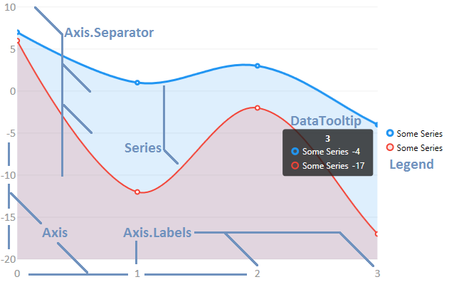
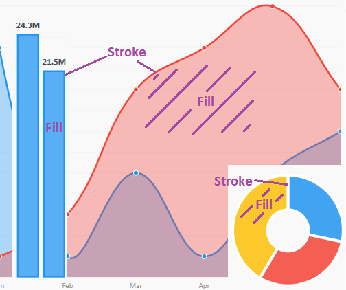

# LiveCharts文档-3开始
## 基本使用
LiveCharts设计的很容易使用，所有的东西都可以自动的实现更新和动画，库会在它觉得有必要更新的时候进行更新，而并非每次你更改了数据的时候更新，当你添加或删除Series，添加或删除Values的时候，Chart会自己自动更新。你可以更多关注到你的业务代码上，绘图的事情它会帮你搞定。  
### 开始例子
已经定义了很多可以绘图的类型，你可以在**类型和自定义**栏目当中找到更多信息。在下面这个例子当中，我们将会绘制double类型的值。
### 后台代码
*图标类型选择CartesianChart,笛卡尔Chart，也即是我们最常见的横轴和纵轴式样的Chart
别忘了using上面提到的命名空间
*
```
myChart.Series = new SeriesCollection
{
    new LineSeries
    {
        Values = new ChartValues<double> { 3, 5, 7, 4 }
    },
    new BarSeries                
    {
        Values = new ChartValues<decimal> { 5, 6, 2, 7 }
    }
};
```
是不是很简单？这就是你所需要做的，现在，每次从SeriesCollection中添加或者删除一个Series的话，或者每次从一个Series中添加或删除一个ChartValue的话，Chart都会自动更新它自己。
### 组件
下面这个图片会让你更加了解LiveCharts  
*这个图让你了解图标的基本概念,比较重要*  


所有的Series都有Stroke和Fill属性.*Stroke的意思就是线条，Fill的意思就是填充。*


默认的情况下，如果你不设置Fill和Stroke的话，LiveCharts会使用预先设定好的颜色，根据每个Series在SeriesCollection中的位置来决定颜色不同。你也可以自己自定义，颜色也可以重复，如果需要重复的话。  
*下面是设置Series的颜色*
```
LiveCharts.Wpf.Charts.Chart.Base.Colors = new List<System.Windows.Media.Color>
{
  System.Windows.Media.Colors.Red,
  System.Windows.Media.Colors.Blue,
  System.Windows.Media.Colors.Green
};
```
这个是特别设定某个Series的Stroke和Fill
```
mySeries.Stroke = System.Windows.Media.Brushes.Red;
mySeries.Fill = System.Windows.Media.Brushes.Blue;
```
也可以设定   
Series.Visibility（这个属性定义了形状的可见性)  
Panel.ZIndex（这个属性定义了重叠的顺序）  
Series.StrokeDashArray（定义了Stroke的Dash）  
```
mySeries.Visibility = System.Windows.Visibility.Hidden;
mySeries.StrokeDashArray = new System.Windows.Media.DoubleCollection {2};
System.Windows.Controls.Panel.SetZIndex(mySeries, 3);
```
### 自定义组件
你也可以在必要的时候定义你自己的tooltips和legends。参考后面的章节。

## 主题
WinForm不支持主题  
WPF和UWP是支持的，具体看原文。