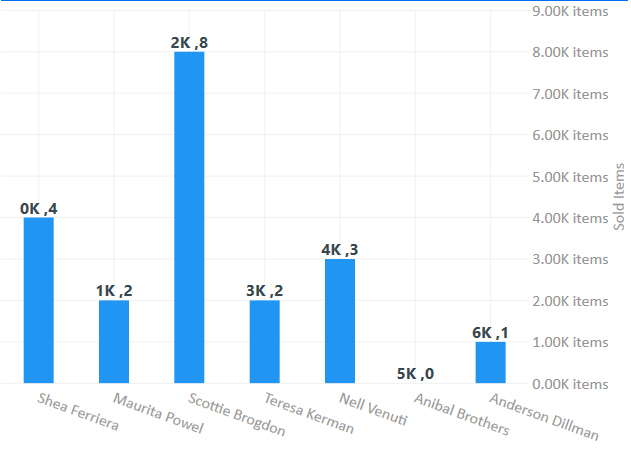

# LiveCharts文档-3开始-7标签
Label就是Chart中表示数值的字符串，通常被放置在轴的位置和提示当中。  
*下图中的这些字符串显示的都是标签*  


```
using System;
using System.Windows.Forms;
using LiveCharts;
using LiveCharts.Defaults;
using LiveCharts.Wpf;
 
namespace Winforms.Cartesian.Labels
{
    public partial class Labels : Form
    {
        public Labels()
        {
            InitializeComponent();
        }
 
        private void Labels_Load(object sender, EventArgs e)
        {
            cartesianChart1.Series.Add(new ColumnSeries
            {
                Values = new ChartValues<ObservableValue>
                {
                    new ObservableValue(4),
                    new ObservableValue(2),
                    new ObservableValue(8),
                    new ObservableValue(2),
                    new ObservableValue(3),
                    new ObservableValue(0),
                    new ObservableValue(1),
                },
                DataLabels = true,
                LabelPoint = point => point.Y + "K"
            });
 
            cartesianChart1.AxisX.Add(new Axis
            {
                Labels = new[]
                {
                    "Shea Ferriera",
                    "Maurita Powel",
                    "Scottie Brogdon",
                    "Teresa Kerman",
                    "Nell Venuti",
                    "Anibal Brothers",
                    "Anderson Dillman"
                },
                Separator = new Separator // force the separator step to 1, so it always display all labels
                {
                    Step = 1,
                    IsEnabled = false //disable it to make it invisible.
                },
                LabelsRotation = 15
            });
 
            cartesianChart1.AxisY.Add(new Axis
            {
                LabelFormatter = value => value + ".00K items",
                Separator = new Separator()
            });
 
        }
    }
}
```

LiveCharts有两种类型的Label，格式化类型和映射类型。  
## 格式化类型
当Chart当中的值和label之间存在直接转换的时候，格式化类型的Label会很有用。比如，在下面的图片中，Y轴值的范围从8到26，但是因为现在的格式化器的作用，我们能够看到8被显示为8.00k。  
Axis.LabelFormatter 可以使用double类型的值作为输入，返回一个string，LiveCharts每次在需要将表的值显示为字符串的时候，就会使用这个函数。
```
MyAxis.LabelFormatter = val => val.ToString("C"); //as currency
MyAxis.LabelFormatter = val => val + "°"; //as degrees
MyAxis.LabelFormatter = val => val + ".00 items sold"; //or any other custom format
```
## 映射类型
当需要用一个名称映射位置的时候，映射类型会很有用，比如第一个点属于john，第二个属于susan，第三个属于charles。  
```
cartesianChart1.AxisX.Add(new LiveCharts.Wpf.Axis
{
   Labels = new[]
   {
      "Shea Ferriera",
      "Maurita Powel",
      "Scottie Brogdon",
      "Teresa Kerman",
      "Nell Venuti",
      "Anibal Brothers",
      "Anderson Dillman"
   }
});
```
映射类型意味着，轴的值将会用Axis.Labels属性当中的字符串来表示，Axis.Labels类型是IList<string> 所以当轴的值是0的时候，标签使用的就是Labels[0],以此类推。  
请注意到轴的值大于Labels的总数的时候，会返回空字符串。   
Axis.Labels隐藏了一个Axis.LabelFormatte，因此当Axis.Labels不是null，那么标签将会从Axis.Labels中找，如果Axis.Labels是null，那么Livecharts将会使用格式化器，如果都是null，那么原始值会被返回。   
## 数据标签
当你需要你的series上的每个点都有一个标签的时候，设置Series.DataLabels属性为true即可。如果必要的话，可以自定义数据标签，使用Series.LabelPoint 属性
```
new ColumnSeries
{
   Values = new ChartValues>double> { 4, 2, 8, 2, 3, 0, 1 },
   DataLabels = true,
   LabelPoint = point => point.Y + "K"
}
```
## 旋转标签
有时候你的标签长度过长，你就需要权衡一下位置，这时候你就可以旋转标签，可以使用任何角度，甚至是负的角度（反方向旋转）。  
```
cartesianChart1.AxisX.Add(new LiveCharts.Wpf.Axis
{
   Labels = new[]
   {
      "Shea Ferriera",
      "Maurita Powel",
      "Scottie Brogdon",
      "Teresa Kerman",
      "Nell Venuti",
      "Anibal Brothers",
      "Anderson Dillman"
   },
   LabelsRotation = 13,
   Separator = new Separator // force the separator step to 1, so it always display all labels
   {
     Step = 1, // if you don't force the separator, it will be calculated automatically, and could skip some labels
     IsEnabled = false //disable it to make it invisible.
   }
});
```
