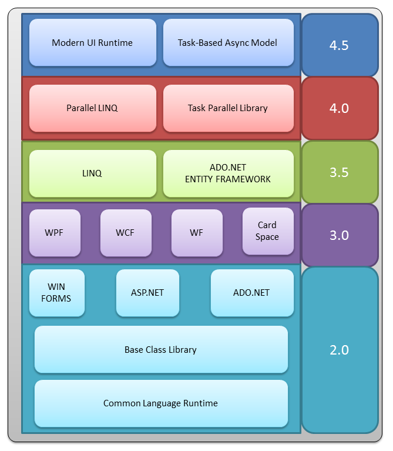

# 如何选择 .NET Framework目标版本
## 简介
.NET Framework是所有 .NET程序赖以运行的基础。  

## 版本
到目前位置 .NET Framework共出了：  
*  .NET Framework 1.0
*  .NET Framework 2.0
*  .NET Framework 3.0
*  .NET Framework 4.0
*  .NET Framework 4.5
*  .NET Framework 4.6
*  .NET Framework 4.7
等几个大版本，其中还有一些小的版本。  
每个版本都是在其他版本的基础上做了很多功能上的改进（*此图来自网络*）。  

## 版本的选择
选择版本有这么几个考虑因素：  
1. 你所用到的功能，参考上面的版本功能图片上的描述，你需要用到什么样的功能，自然需要选择那个版本。
2. 你的目标平台默认支持哪个版本的 .NET Framework，xp默认没带.Net Framework，vista是2.0，win7自带的是3.5，win8支持4.0,Win8.1支持4.5和win10支持4.6；如果按照对应关系选择的话，部署的时候就不用单独安装 .NET Framework了，否则就要单独下载安装。
## 下载

现在微软的网站上提供这些版本，其他版本没有直接给出链接，需要自行搜索一下。  
其中：  
1. Web Installer是下载一个下载器，然后下载器会下载对应的版本的 .NET Framework来进行安装，如果系统有比这个版本更新的版本，会自动提示并停止安装，这个是最常用的一种方式。  
2. 对于没有网络的计算机安装 .NET Framework，则必须下载Offline版本。
3. SDK=Software Development Kit，软件开发包，里面包含了上面提到的 .NET Framework外，还包含开发用到的东西，一般安装Visual Studio的时候会默认安装这些，对于仅仅是运行程序的客户机器则无需安装sdk。
4. 有些版本，比如3.5和4.0都有一个叫做client profile的版本，据说是对完整版本的一个简化版本，说实话，我觉得这个真的没有必要，现在硬盘又不缺那点空间，没必要为区分哪些功能可以用，哪些功能不能用去安装这么一个版本来自讨苦吃。

## 参考资料
[微软 .NET网站](https://www.microsoft.com/net)
