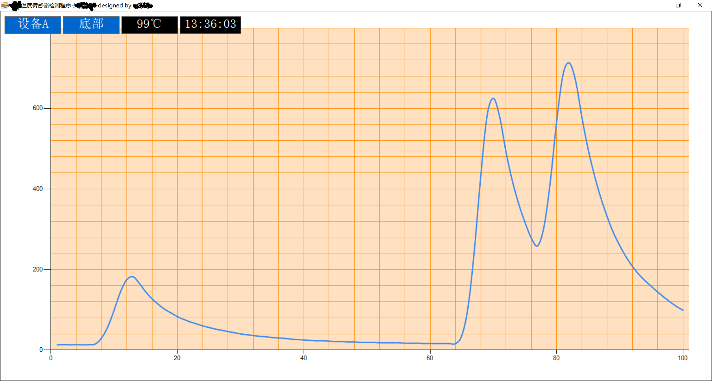

# 做了一个串口读写温度的程序

## 目的
因为公司需要一个热电偶来测试机器内部的实际温度，之前是靠人手工记录，但是因为人的因素，记录间隔时间太长，导致记录的数据意义不大，而且人长时间值守确实很无聊，现在需要用程序将人工取代以提高效率和精度，所以采购了温湿度差传感器和usb接口(usb转R485)，打算做一个自动采集程序来代替人员工作；
## 硬件连接
硬件连接很简单，按照传感器的线序和usb接口对应上就行了，然后把usb接口通过转接线接到电脑usb口上。按照商家提供的驱动安装说明安装usb接口驱动，就会在设备管理器里看到一个串口，至此，硬件部分准备完毕。
## 软件调试
这个传感器的协议是MODBUS,需要读写16进制的字符数组到设备。先用商家配的串口调试助手来测试通信协议代码，测试正常后将会用到的几个代码保存后面用。
## 串口数据读取和写入
软件部分使用的是 .NET里的System.IO.Ports里的SerialPort类。设置串口，读写串口的方法都是线程的。没有什么太多的难度。  
唯一麻烦的地方：  
1. 一个在于如何在16进制表示的字符串和byte[]之间的转换。
2. 一个在于如何对这个字符串进行CRC16_MODBUS校验。

16进制的字符串比如，"01 03 01 F4 00 02"，中间用空格隔开的，需要先去除空格，然后每两位当成一个16进制的表示，然后转换为byte，用的方法是Convert.ToByte(取到的2位字符串，16)，然后存储在byte中。应为两位的16进制最小是0（00），最大的255（FF），只需要不断执行这个过程就可以把整个字符串全部转换存入byte[]中。  
接下来是生成前面字符串的CRC校验码，这个我查了一下校验方法的写法，觉得自己写起来还是挺麻烦的，于是就在Nuget上找了一下现成的校验方法，找到一个Toko.CRC，很容易使用的一个CRC校验库。通过它可以给现有的string生成CRC16_MODBUS类型的校验码。  
之后需要将校验码和前面的byte[]数组进行结合，校验码的高位放在后面，地位放在前面；比如校验码是05 25,追加到前面byte[]的时候就是2505，这个是协议的要求。
然后使用port.Write，将byte[]写入到串口写缓冲区就可以了。  
写完之后要将当前线程暂停一会儿，因为传感器返回读取的数据到读缓冲区需要时间，暂停结束后再通过port.Read的方式读取byte[],（可选：这里可以考虑对读取的byte[]进行CRC校验，确定数据OK，或者简单的对byte[]的长度进行判断，看读取过程中是否有问题）需要先将byte[]转换回16进制表示的字符串,使用"{0:x2}"格式化，然后把对应需要的数据位的字符串取下来，然后再将这些字符串分别转换为十进制数字，存入设定的变量当中。  
## 数据处理和绘图
得到温度和湿度的数据之后就简单了，需要存入文件存文件，需要显示显示，需要绘图绘图。不再阐述。

